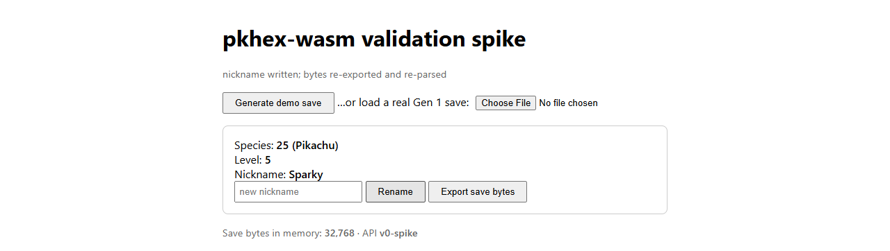

# pkhex-wasm

PKHeX.Core Pokémon save editing, compiled to WebAssembly and packaged for npm — so JavaScript apps can load, read, edit, and export save files entirely in the browser.

> **Status: v1 specification locked.** The full JS API contract lives at [`docs/spec/v1-api.md`](docs/spec/v1-api.md) — hosting, transport, crypto, support tiers, testing and packaging gates are all decided ([wayfinder map](https://github.com/EthanThatOneKid/pkhex-wasm/issues/1)). Not yet published to npm; implementation is underway from the locked spec. Browsable API docs: <https://ethanthatonekid.github.io/pkhex-wasm/>

## What works today

The [validation spike](spike/) proves the whole pipeline end-to-end in a real browser:

- PKHeX.Core compiles and runs on the bare Mono-wasm runtime — no Blazor anywhere
- JavaScript calls into .NET through `[JSExport]` (bytes in both directions)
- Load a save file → read box Pokémon → edit a nickname → export bytes back to disk
- ~6 MB gzipped transferred to interactive



## Run it locally

Prerequisites:

- [.NET SDK 10.x](https://dotnet.microsoft.com/download/dotnet/10.0)
- Node.js ≥ 18 (used only as a static file server)
- Git with submodule support

```bash
git clone https://github.com/EthanThatOneKid/pkhex-wasm
cd pkhex-wasm
git submodule update --init --recursive

dotnet publish spike/SpikeApp -c Release
npx http-server spike/SpikeApp/bin/Release/net10.0/publish/wwwroot
# open http://127.0.0.1:8123
```

> The vendored upstream (`external/PKHeX.Everywhere`) declares two nested submodules. Only its `external/PKHeX` fork is needed for the spike; `PKHeX-Plugins` is not referenced. To skip the large Plugins clone:
>
> ```bash
> git -C external/PKHeX.Everywhere submodule update --init external/PKHeX
> ```

In the page: **Generate demo save** creates a blank Gen 1 save with a level-5 Pikachu in box 1, **Rename** writes the edit and re-parses it through the binding, **Export** downloads the bytes as a `.sav` file, and the file picker loads any real Gen 1 `.sav`.

## Development

```bash
dotnet test pkhex-wasm.slnx   # C# logic-seam suite
deno task gen                 # regenerate d.ts + binding skeleton + spec chapter
deno task gen:check           # drift gate — fails when outputs lag the model
deno task apigen:test         # generator tests
deno task doc                 # rebuild the docs site input locally
```

| Path | What it is |
| --- | --- |
| `spike/SpikeLib` | Save logic over PKHeX.Core (generate / load / read / edit / export), no interop concerns |
| `spike/SpikeLib.Tests` | xUnit tests for the logic seam |
| `spike/SpikeApp` | `wasmbrowser` host exposing the logic via `[JSExport]`, plus a minimal HTML UI |
| `tools/apigen` | API model + ts-morph generators — single source of truth for the v1 surface |
| `src/ts` | TypeScript binding skeleton bootstrapped by the generator (`gen/` stays generated) |
| `docs/spec/v1-api.md` | The locked v1 JavaScript API specification |
| `external/PKHeX.Everywhere` | Vendored upstream (MIT facade/web layers wrapping the GPLv3 `PKHeX.Core` fork, itself a nested submodule) |

## Roadmap

Every decision feeding v1 is resolved — see [Decisions so far](https://github.com/EthanThatOneKid/pkhex-wasm/issues/1) on the map. Next: implementation sessions building against [`docs/spec/v1-api.md`](docs/spec/v1-api.md), then npm publication under the packaging gates it defines.

## License

The vendored `PKHeX.Core` is **GPLv3**; obligations flow to anything linking it, including this package's wasm bundle. This repo's own licensing is being settled alongside the compliance work tracked on the map.
